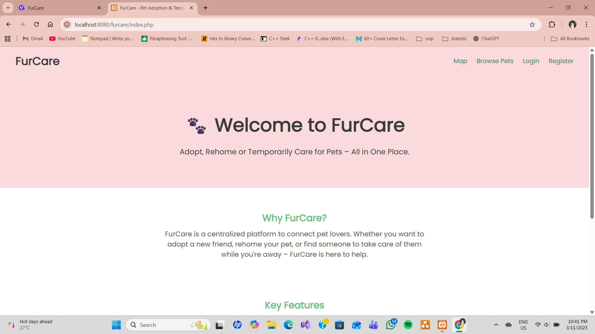
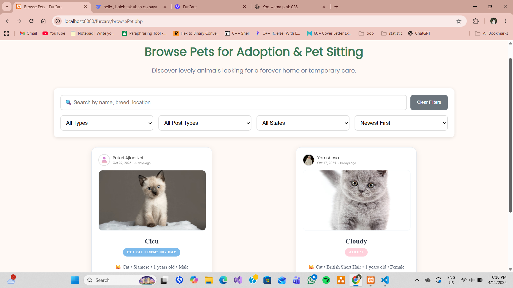
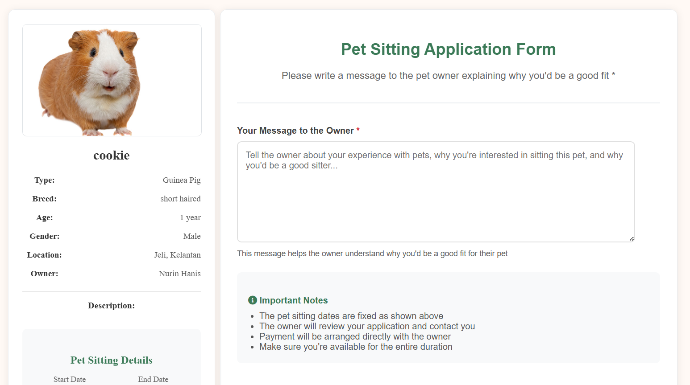
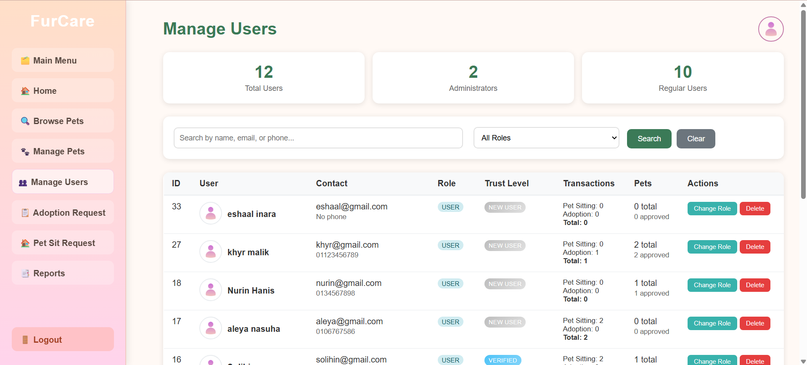

# 🐾 FurCare

A web-based pet adoption and pet sitting platform developed as my diploma final year project. FurCare connects pet owners with adopters and temporary pet sitters through a user-friendly online platform.

---

## 📖 Overview

FurCare is designed to simplify pet adoption and temporary pet care services.

The system allows users to browse pets available for adoption, request pet sitting services, manage their requests, and interact with the platform through an intuitive web interface. Administrators can monitor users, pets, and requests from a centralized dashboard.

---

## ✨ Features

- 🔐 User registration and login
- 🐶 Browse pets available for adoption
- ❤️ Submit adoption requests
- 🏠 Request pet sitting services
- ⭐ Submit reviews
- 👤 User profile management
- 📄 Generate receipts
- 📧 Email notification support
- 👨‍💼 Admin dashboard
- 📊 Manage users, pets and requests

---

## 🛠️ Technologies Used

- PHP
- HTML5
- CSS3
- JavaScript
- MySQL
- PHPMailer
- XAMPP

---

## 📸 System Preview

### Home Page

### Browse Pets

### Pet Sitting

### Admin Dashboard

---

## 🔄 System Workflow

1. Users create an account and log in.
2. Browse pets available for adoption.
3. Submit adoption or pet sitting requests.
4. Manage requests and personal information.
5. Administrators review and manage pets, users, and requests through the dashboard.

---

## 📚 What I Learned

Through this project, I gained practical experience in:

- Developing full-stack web applications using PHP and MySQL
- Implementing user authentication and session management
- Performing CRUD operations
- Managing relational databases
- Integrating email functionality using PHPMailer
- Designing responsive web interfaces
- Building an admin management system

---

## ⚠️ Disclaimer

This repository is shared for educational and portfolio purposes only. Any sensitive information, credentials, and personal data have been removed.

---

## 👩‍💻 Author

**Amni Aqilah**

📧 amniaqilah24@gmail.com

🔗 LinkedIn: https://www.linkedin.com/in/amni-aqilah-b94283371/

💻 GitHub: https://github.com/amninraqilah
